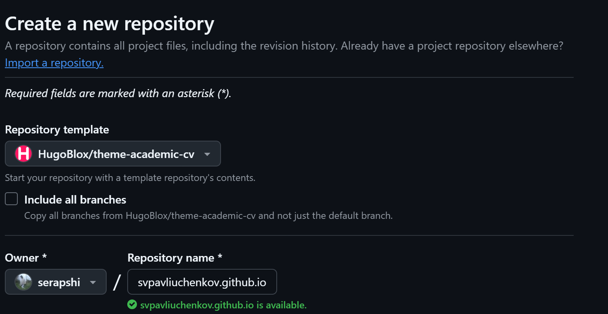
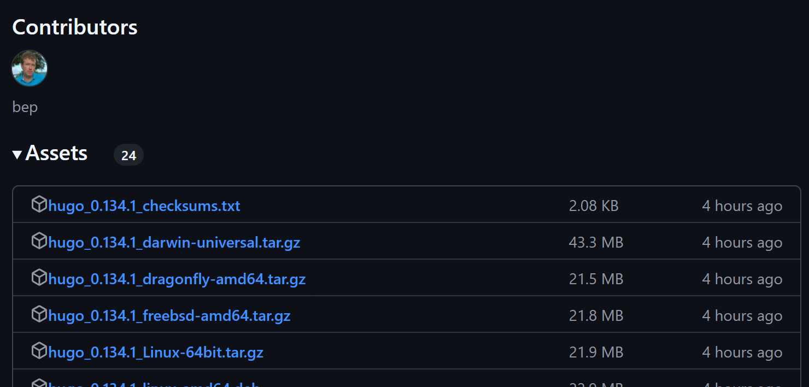
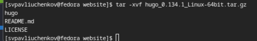
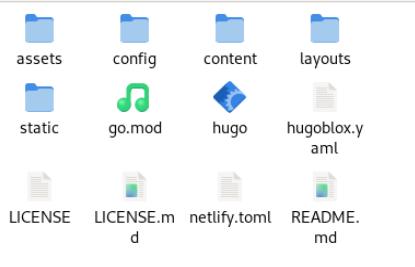
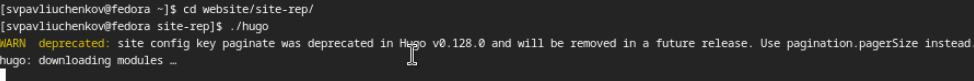
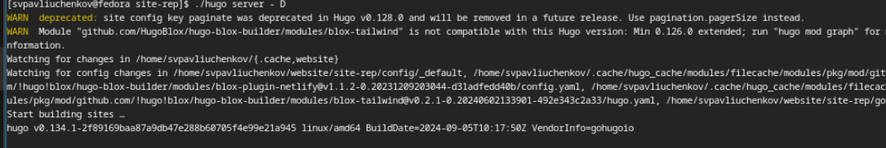
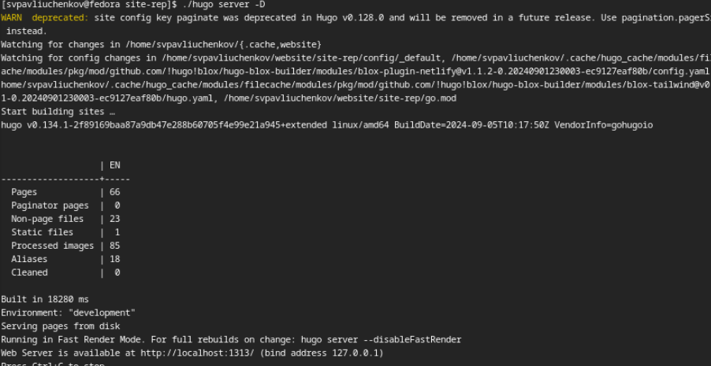
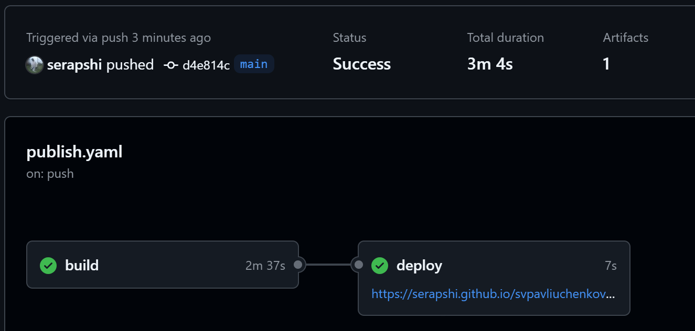

---
## Front matter
lang: ru-RU
title: Шаги выполнение 1 этапа индивидуального проекта. 
subtitle: Размещение на Github pages заготовки для персонального сайта.
author:
  - Павлюченков С.В.
institute:
  - Российский университет дружбы народов, Москва, Россия
date: 07 сентября 2024

## i18n babel
babel-lang: russian
babel-otherlangs: english

## Formatting pdf
toc: false
toc-title: Содержание
slide_level: 2
aspectratio: 169
section-titles: true
theme: metropolis
header-includes:
 - \metroset{progressbar=frametitle,sectionpage=progressbar,numbering=fraction}
---

## Докладчик

:::::::::::::: {.columns align=center}
::: {.column width="70%"}

  * Павлюченков Сергей Витальевич
  * Студент ФФМиЕН
  * Российский университет дружбы народов
  * [1132237372@pfur.ru](mailto:1132237372@pfur.ru)
  * <https://serapshi.github.io/svpavliuchenkov.github.io/>

:::
::: {.column width="30%"}

:::
::::::::::::::

## Цель работы

Разместить заготовку для индивидуального проекта на сервисе Github Pages.

## Задание

Установить необходимое программное обеспечение.
Скачать шаблон темы сайта.
Разместить его на хостинге git.
Установить параметр для URLs сайта.
Разместить заготовку сайта на Github pages.

## Создание репозитория с шаблоном

{#fig:001 width=70%}

## Установка ПО

{#fig:002 width=70%}

## Установка ПО

Распаковываю расширенную версию hugo на своей виртуальной машине. 

{#fig:003 width=70%}

## Установка ПО

{#fig:004 width=70%}

## Подготовка к запуску сайта

{#fig:005 width=70%}

Запускаю локальный сервер hugo.

{#fig:006 width=70%}

## Запуск шаблона сайта по адресу localhost:1313

{#fig:007 width=70%}

## Запуск шаблона сайта по адресу localhost:1313

{#fig:008 width=70%}

## Размещение  сайта на Github Pages

{#fig:009 width=70%}

## Выводы

Мне удалось разместить шаблон индивидуального проекта на сервесе github pages для последующего улучшения и использования.
