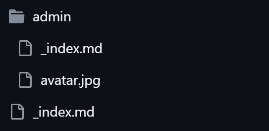
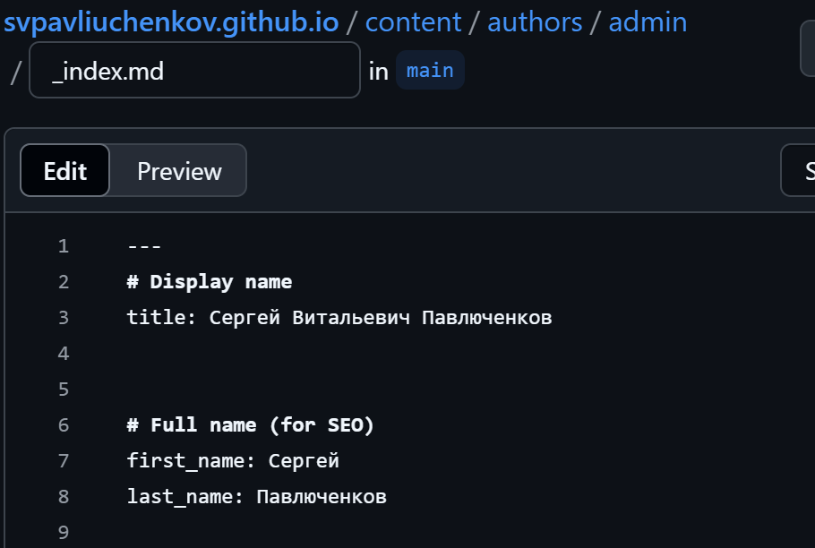
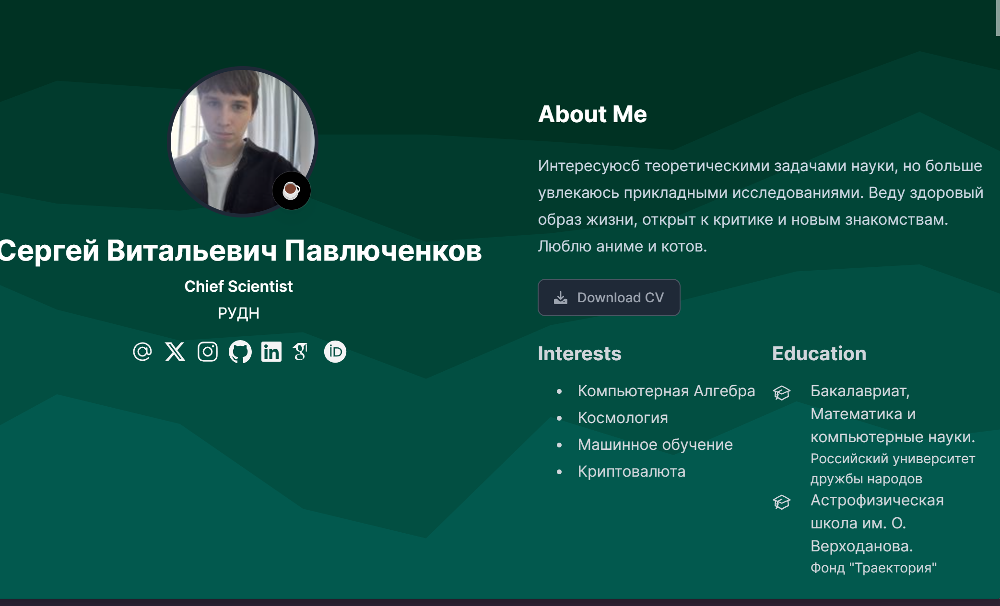
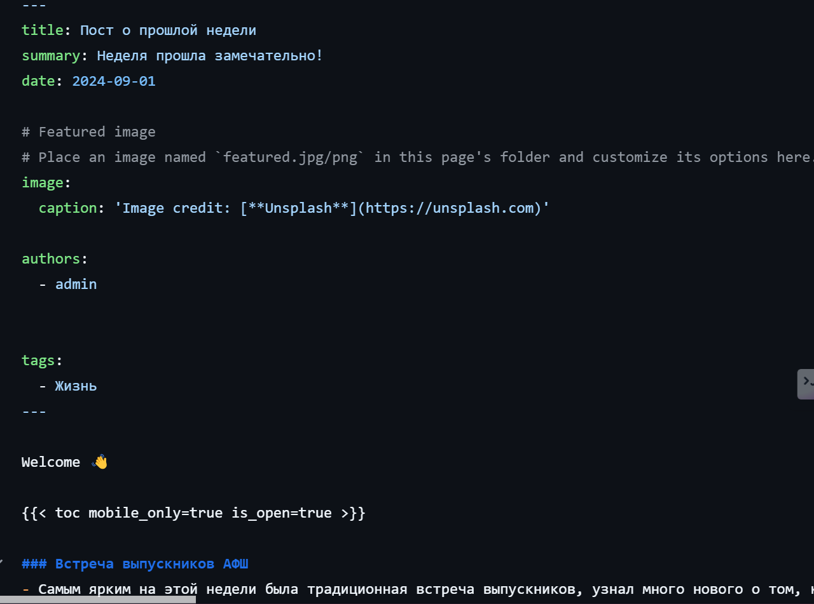
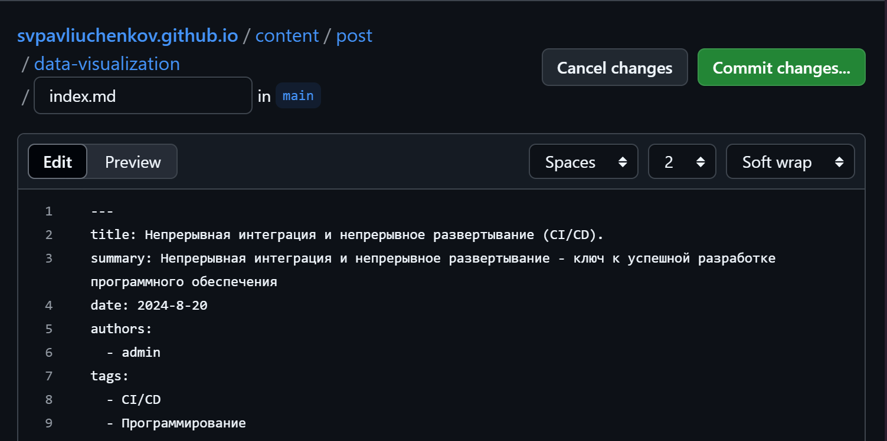
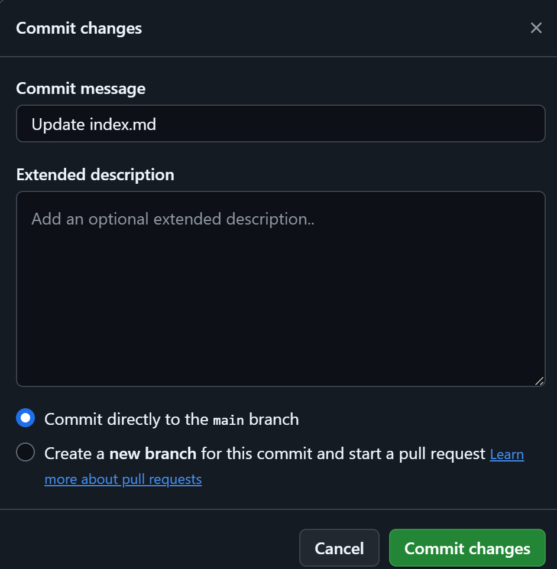
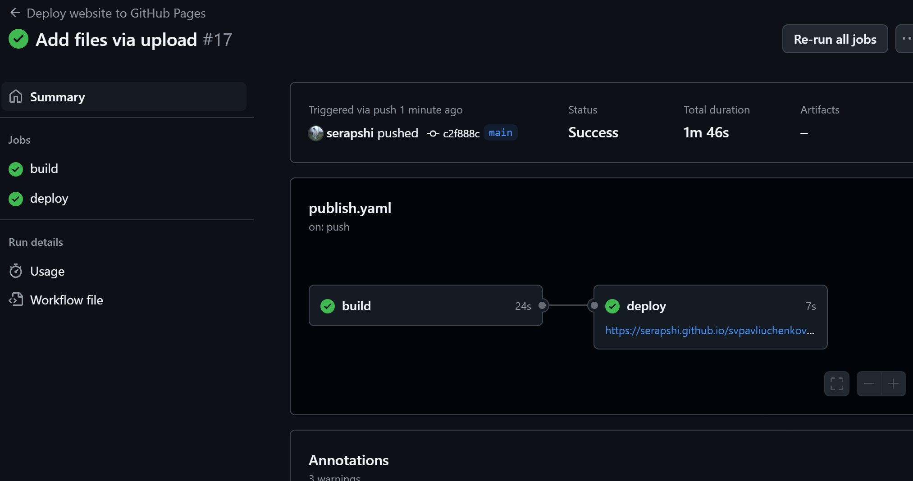
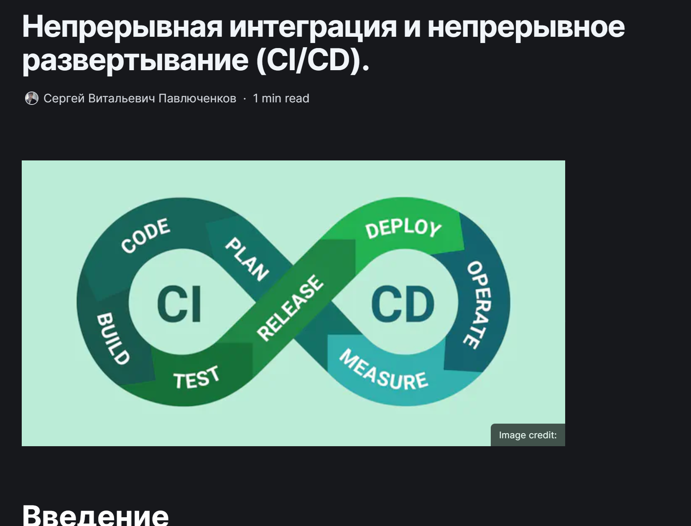

---
## Front matter
lang: ru-RU
title: Выполнение 2 этапа индивидуального проекта.
subtitle: Добавление к сайту данных о себе
author:
  - Павлюченков С.В.
institute:
  - Российский университет дружбы народов, Москва, Россия
date: 07 сентября 2024

## i18n babel
babel-lang: russian
babel-otherlangs: english

## Formatting pdf
toc: false
toc-title: Содержание
slide_level: 2
aspectratio: 169
section-titles: true
theme: metropolis
header-includes:
 - \metroset{progressbar=frametitle,sectionpage=progressbar,numbering=fraction}
---

## Докладчик

:::::::::::::: {.columns align=center}
::: {.column width="70%"}

  * Павлюченков Сергей Витальевич
  * Студент ФФМиЕН
  * Российский университет дружбы народов
  * [1132237372@pfur.ru](mailto:1132237372@pfur.ru)
  * <https://serapshi.github.io/svpavliuchenkov.github.io/>

:::
::: {.column width="30%"}

:::
::::::::::::::

## Цель работы

Персонализация сайта под себя, добавление фотографии и информации.

## Задание

Разместить фотографию владельца сайта.
Разместить краткое описание владельца сайта (Biography).
Добавить информацию об интересах (Interests).
Добавить информацию от образовании (Education).
Сделать пост по прошедшей неделе.
Добавить пост на тему по выбору:
Управление версиями. Git.
Непрерывная интеграция и непрерывное развертывание (CI/CD).

## Выполнение лабораторной работы

Нахожу файл в который нужно вносить большинство изменений.

{#fig:001 width=70%}

## Редактирование информации

{#fig:002 width=70%}

## Новый вид сайта

Добавляю свое фото, собираю сайт и проверяю все ли верно.

{#fig:003 width=70%}

## Создание нового материала

Перехожу в директорию content/post/
и создаю пост о прошедшец недели.

{#fig:004 width=70%}

## Создание нового материала

{#fig:005 width=70%}

## Загрузка поста на github.

{#fig:006 width=70%}

## Сборка сайта

{#fig:008 width=70%}

## Проверка результатов

{#fig:009 width=70%}

## Выводы

Я переделал шаблон индивидуального проекта под себя, добавил свое фото, имя и фамилию, краткую информацию, дополнительную информацию и научился создавать посты в блоге.

