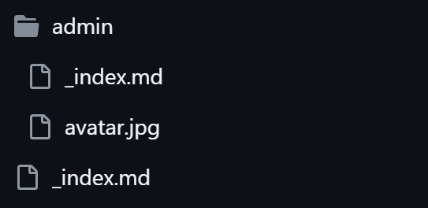
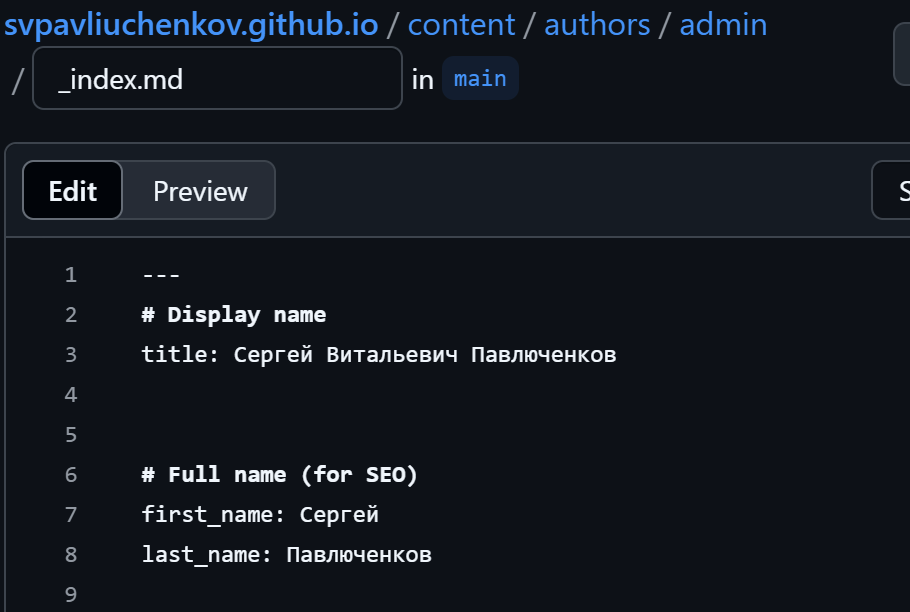
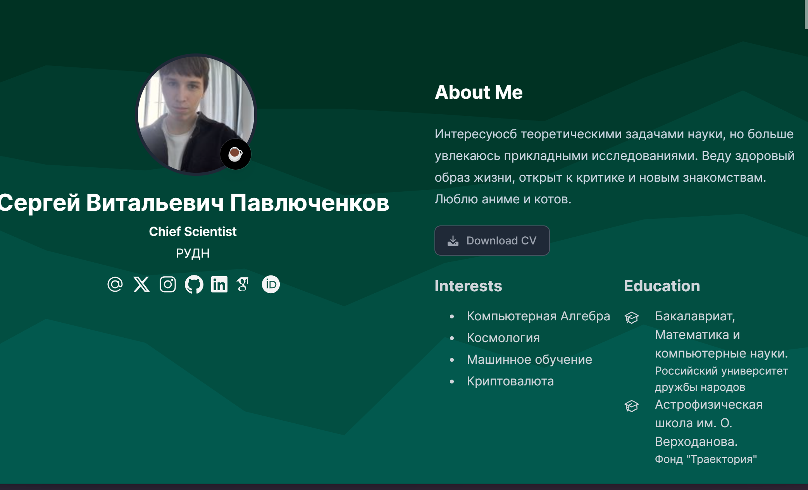
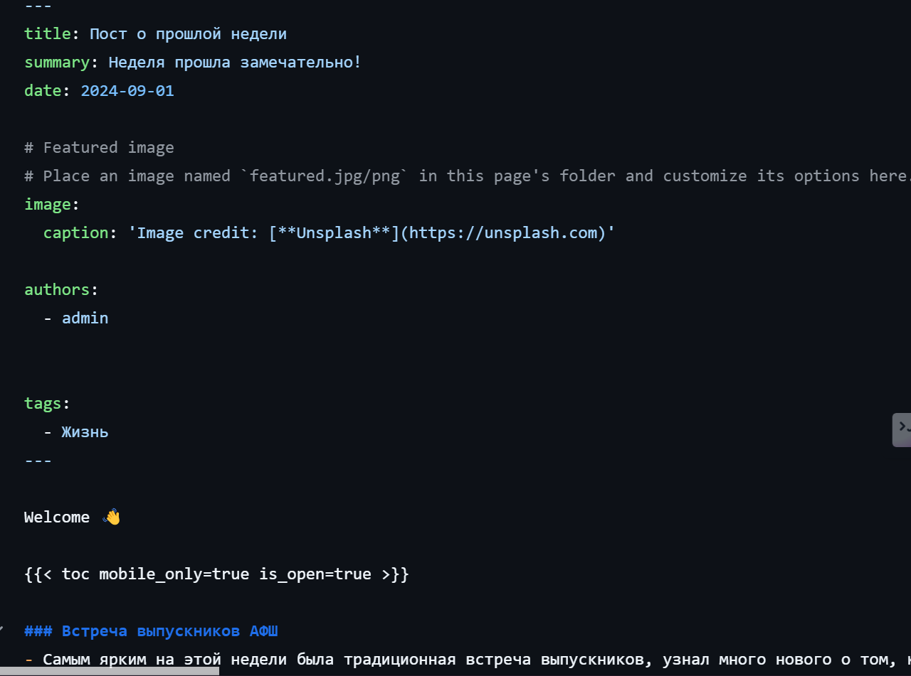
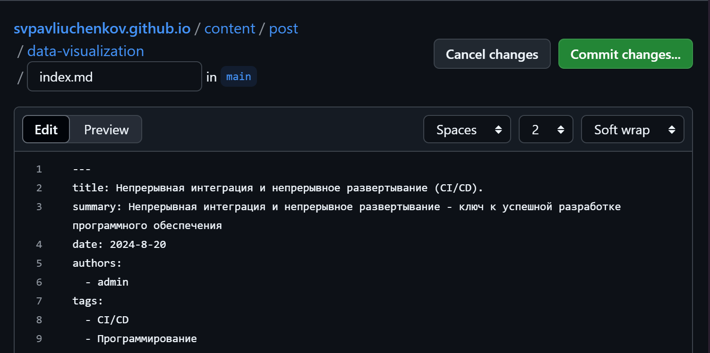
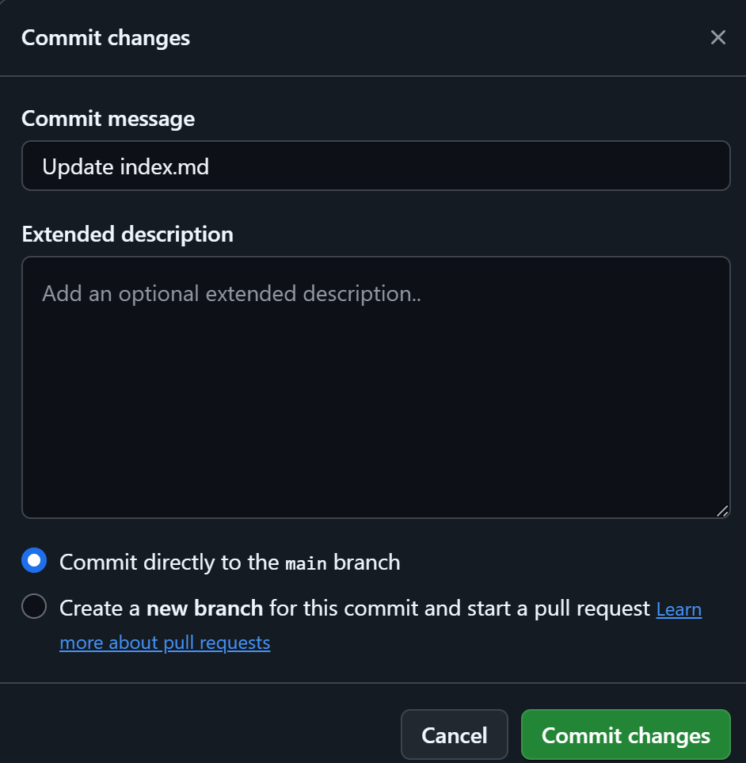
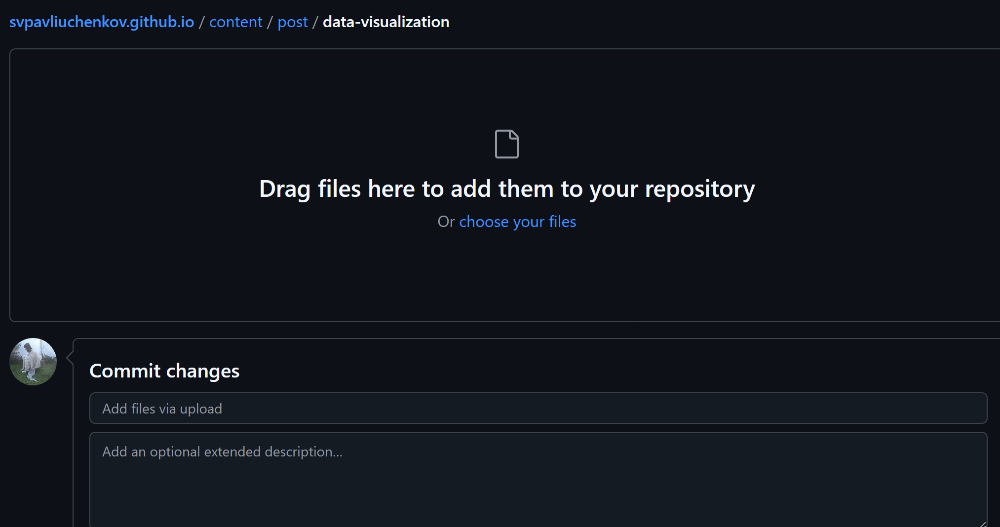
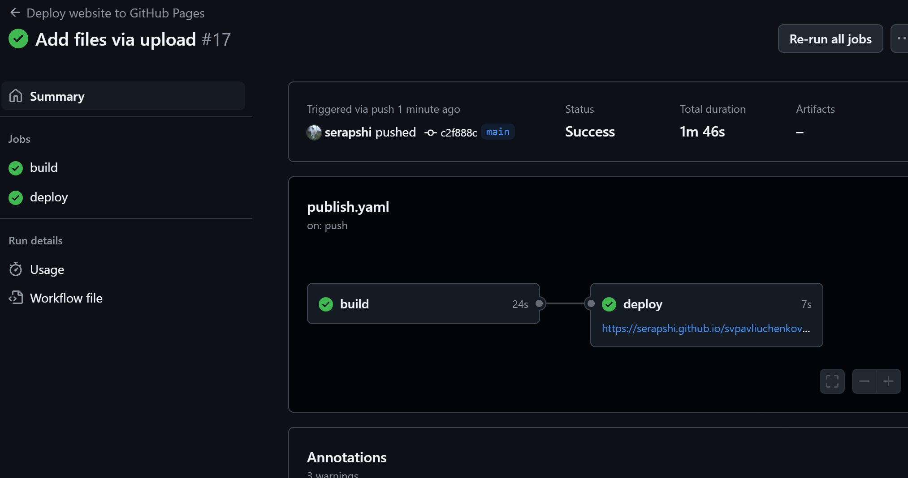
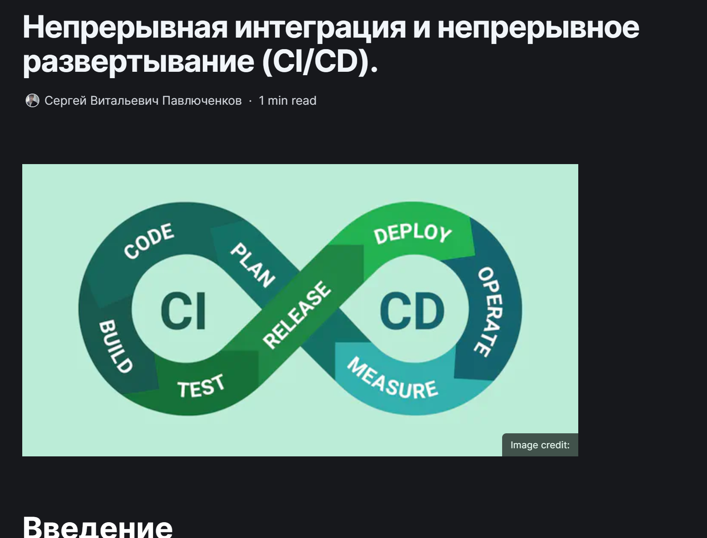

---
## Front matter
title: "Отчёт по 2 этапу индивидуального проекта"
subtitle: "Добавление к сайту данные о себе"
author: "Сергей Витальевич Павлюченков"

## Generic otions
lang: ru-RU
toc-title: "Содержание"

## Bibliography
bibliography: bib/cite.bib
csl: pandoc/csl/gost-r-7-0-5-2008-numeric.csl

## Pdf output format
toc: true # Table of contents
toc-depth: 2
lof: true # List of figures
lot: true # List of tables
fontsize: 12pt
linestretch: 1.5
papersize: a4
documentclass: scrreprt
## I18n polyglossia
polyglossia-lang:
  name: russian
  options:
	- spelling=modern
	- babelshorthands=true
polyglossia-otherlangs:
  name: english
## I18n babel
babel-lang: russian
babel-otherlangs: english
## Fonts
mainfont: PT Serif
romanfont: PT Serif
sansfont: PT Sans
monofont: PT Mono
mainfontoptions: Ligatures=TeX
romanfontoptions: Ligatures=TeX
sansfontoptions: Ligatures=TeX,Scale=MatchLowercase
monofontoptions: Scale=MatchLowercase,Scale=0.9
## Biblatex
biblatex: true
biblio-style: "gost-numeric"
biblatexoptions:
  - parentracker=true
  - backend=biber
  - hyperref=auto
  - language=auto
  - autolang=other*
  - citestyle=gost-numeric
## Pandoc-crossref LaTeX customization
figureTitle: "Рис."
tableTitle: "Таблица"
listingTitle: "Листинг"
lofTitle: "Список иллюстраций"
lotTitle: "Список таблиц"
lolTitle: "Листинги"
## Misc options
indent: true
header-includes:
  - \usepackage{indentfirst}
  - \usepackage{float} # keep figures where there are in the text
  - \floatplacement{figure}{H} # keep figures where there are in the text
---

# Цель работы

Персонализация сайта под себя, добавление фотографии и информации.

# Задание

Разместить фотографию владельца сайта.
Разместить краткое описание владельца сайта (Biography).
Добавить информацию об интересах (Interests).
Добавить информацию от образовании (Education).
Сделать пост по прошедшей неделе.
Добавить пост на тему по выбору:
Управление версиями. Git.
Непрерывная интеграция и непрерывное развертывание (CI/CD).

# Выполнение лабораторной работы

Нахожу файл в который нужно вносить большинство изменений.

{#fig:001 width=70%}

Заменяю данные из шаблона под свои.

{#fig:002 width=70%}

Добавляю свое фото, собираю сайт и проверяю все ли верно.

{#fig:003 width=70%}

Перехожу в директорию content/post/
и создаю пост о прошедшец недели.

{#fig:004 width=70%}

Создаю пост о CI/CD.

{#fig:005 width=70%}

Загружаю пост на github.

{#fig:006 width=70%}

Загружаю картинку для поста о CI/CD.

{#fig:007 width=70%}

Собираю новую версию сайта с двумя постами.

{#fig:008 width=70%}

Открываю пост о CI/CD, чтобы удостовериться в его целостностию 

{#fig:009 width=70%}

# Выводы

Я переделал шаблон индивидуального проекта под себя, добавил свое фото, имя и фамилию, краткую информацию, дополнительную информацию и научился создавать посты в блоге.

