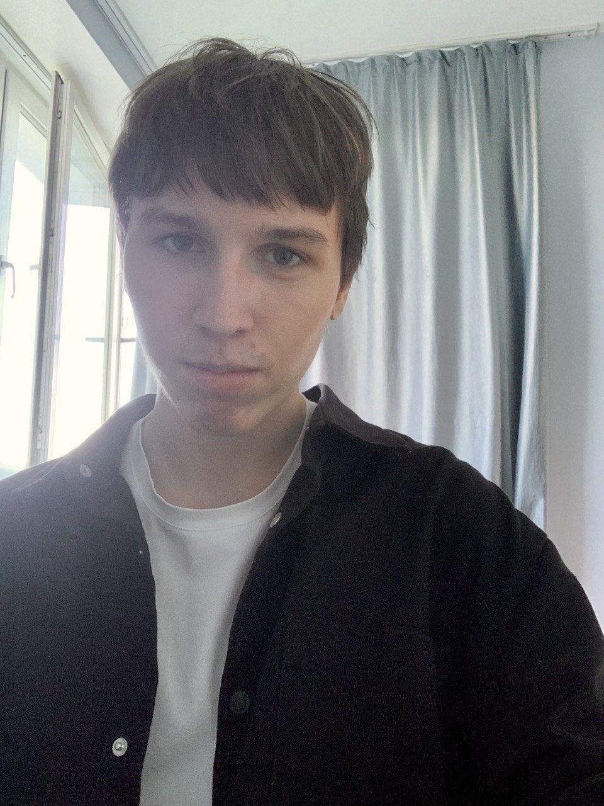

---
## Front matter
lang: ru-RU
title: Выполнение 3 этапа индивидуального проекта
subtitle: Добавление к сайту достижения
author:
  - Павлюченков С.В.
institute:
  - Российский университет дружбы народов, Москва, Россия
date: 07 сентября 2024

## i18n babel
babel-lang: russian
babel-otherlangs: english

## Formatting pdf
toc: false
toc-title: Содержание
slide_level: 2
aspectratio: 169
section-titles: true
theme: metropolis
header-includes:
 - \metroset{progressbar=frametitle,sectionpage=progressbar,numbering=fraction}
---

## Докладчик

:::::::::::::: {.columns align=center}
::: {.column width="70%"}

  * Павлюченков Сергей Витальевич
  * Студент ФФМиЕН
  * Российский университет дружбы народов
  * [1132237372@pfur.ru](mailto:1132237372@pfur.ru)
  * <https://serapshi.github.io/svpavliuchenkov.github.io/>

:::
::: {.column width="30%"}

:::
::::::::::::::

## Цель работы

Добавить больше информации обо мне, и создать материал для сайта.

## Задание

Добавить информацию о навыках (Skills).
Добавить информацию об опыте (Experience).
Добавить информацию о достижениях (Accomplishments).
Сделать пост по прошедшей неделе.
Добавить пост на тему по выбору:
Легковесные языки разметки.
Языки разметки. LaTeX.
Язык разметки Markdown.

## Выполнение лабораторной работы

{#fig:001 width=70%}

## Редактирование сайта

{#fig:002 width=70%}

## Редактирование сайта

{#fig:003 width=70%}

## Загрузка обновленного файла на гитхаб

{#fig:004 width=70%}

## Сборка сайта

{#fig:005 width=70%}

## Проверка нового 

{#fig:006 width=70%}

## Создание поста о прошедшей недели

{#fig:007 width=70%}

## Проверка нового поста 

{#fig:008 width=70%}

## Написание новыго поста о языке разметки Markdown.

{#fig:009 width=70%}

## Выводы

Выполнив данный этап индивидуально проект, я успешно расширил количество информации обо мне на сайте, также пополнил блог двумя новыми постами.

