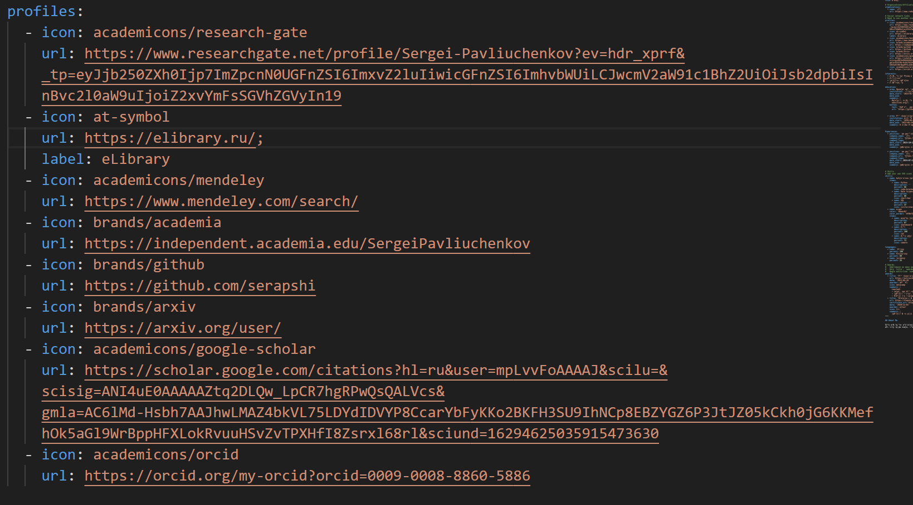
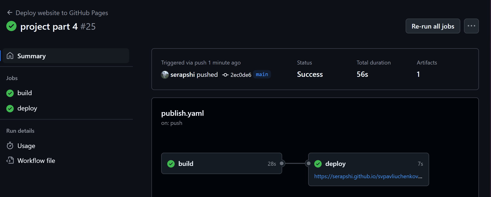
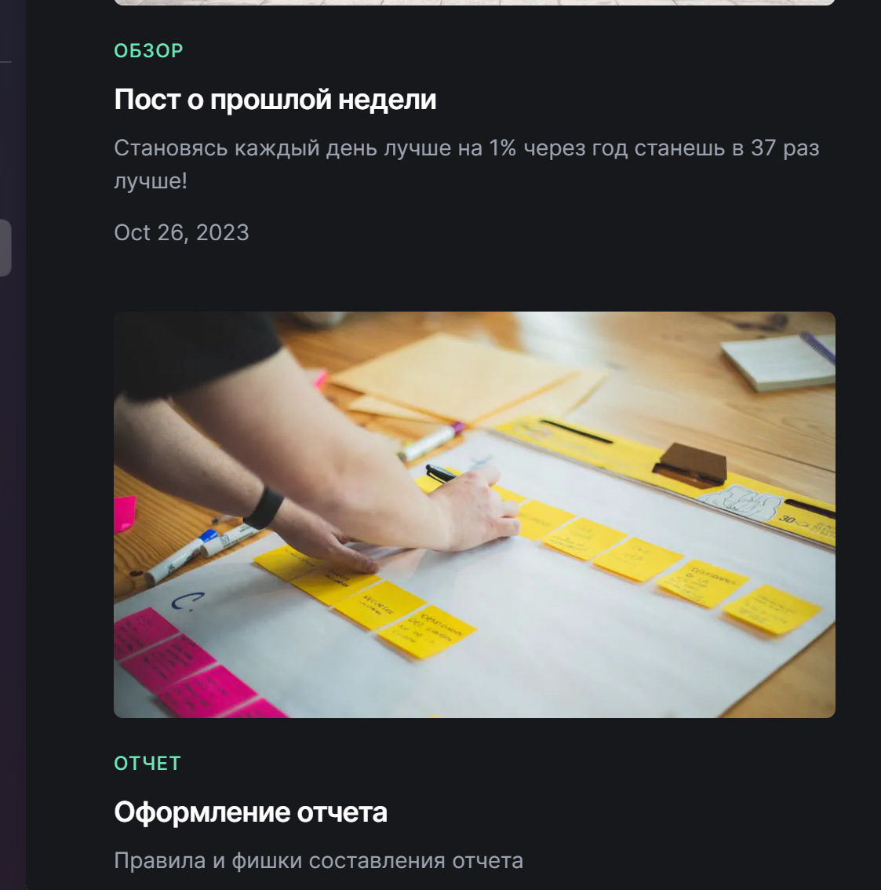

---
## Front matter
lang: ru-RU
title: Выполнение 4 этапа индивидуального проекта
subtitle: Добавление к сайту ссылок на научные и библиометрические ресурсы.
author:
  - Павлюченков С.В.
institute:
  - Российский университет дружбы народов, Москва, Россия
date: 07 сентября 2024

## i18n babel
babel-lang: russian
babel-otherlangs: english

## Formatting pdf
toc: false
toc-title: Содержание
slide_level: 2
aspectratio: 169
section-titles: true
theme: metropolis
header-includes:
 - \metroset{progressbar=frametitle,sectionpage=progressbar,numbering=fraction}
---

## Докладчик

:::::::::::::: {.columns align=center}
::: {.column width="70%"}

  * Павлюченков Сергей Витальевич
  * Студент ФФМиЕН
  * Российский университет дружбы народов
  * [1132237372@pfur.ru](mailto:1132237372@pfur.ru)
  * <https://serapshi.github.io/svpavliuchenkov.github.io/>

:::
::: {.column width="30%"}

:::
::::::::::::::

## Цель работы

Дополнить свой сайт ссылками на научные и библиометрические ресурсы и пополнить блог новым материалом.

## Задание

Зарегистрироваться на соответствующих ресурсах и разместить на них ссылки на сайте:
eLibrary : https://elibrary.ru/;
Google Scholar : https://scholar.google.com/;
ORCID : https://orcid.org/;
Mendeley : https://www.mendeley.com/;
ResearchGate : https://www.researchgate.net/;
Academia.edu : https://www.academia.edu/;
arXiv : https://arxiv.org/;
github : https://github.com/.
Сделать пост по прошедшей неделе.
Добавить пост на тему по выбору:
Оформление отчёта.
Создание презентаций.
Работа с библиографией.

## Выполнение лабораторной работы

После успешной регистрации на каждом из сервисов, я добавил каждую ссылку в свой профиль в файле index.md директории admin.

{#fig:001 width=70%}

## Сборка сайта с обновленным файлом index.md

После загрузки новых данных, успешно собираю сайт на сервере.

{#fig:002 width=70%}

## Новый вид сайта

Проверяю, как выглядят добавленные ссылки на разные ресурсы.

{#fig:003 width=70%}

## Пополнение материала блога

Аналогично прошлым этапам, создаю два поста: первый о прошедшей недели, а второй о создании отчетов. Также загружаю все на гитхаб и проверяю, как все отображается на сайте.

{#fig:004 width=70%}

## Выводы

Я зарегистрировался на многих библиометрических платформах, где в последующем можно будет отмечать свои статьи. Также улучшил навык создания постов на основе Hugo blox.
