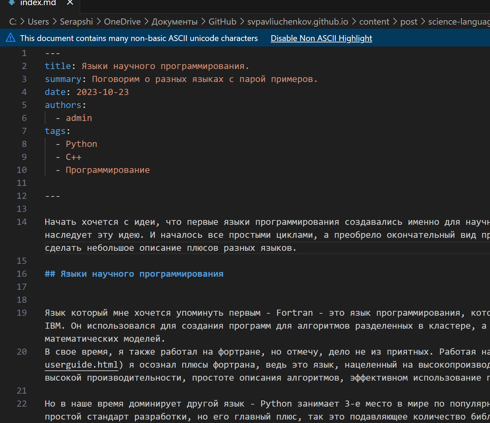

---
## Front matter
lang: ru-RU
title: Выполнение 5 этапа индивидуального проекта
subtitle: Добавление персональных проектов
author:
  - Павлюченков С.В.
institute:
  - Российский университет дружбы народов, Москва, Россия
date: 07 сентября 2024

## i18n babel
babel-lang: russian
babel-otherlangs: english

## Formatting pdf
toc: false
toc-title: Содержание
slide_level: 2
aspectratio: 169
section-titles: true
theme: metropolis
header-includes:
 - \metroset{progressbar=frametitle,sectionpage=progressbar,numbering=fraction}
---

## Докладчик

:::::::::::::: {.columns align=center}
::: {.column width="70%"}

  * Павлюченков Сергей Витальевич
  * Студент ФФМиЕН
  * Российский университет дружбы народов
  * [1132237372@pfur.ru](mailto:1132237372@pfur.ru)
  * <https://serapshi.github.io/svpavliuchenkov.github.io/>

:::
::: {.column width="30%"}

:::
::::::::::::::

## Цель работы

Добавить на сайт информацию о проектах в которых, я до сих пор участвую или участвовал.

## Задание

Сделать записи для персональных проектов.
Сделать пост по прошедшей неделе.
Добавить пост на тему по выбору.
Языки научного программирования.

## Добавление персонального проекта

Обновляю информацию в директории content/project, а именно, переименновываю директорию шаблонного проекта в FDM, после чего меняю информацию в файле index.md на информацию о своей работе.

{#fig:001 width=70%}

## Страница с проектами 

{#fig:003 width=70%}

## Переход на информацию о проекте

{#fig:007 width=70%}

## Загрузка нового материала в блог

{#fig:002 width=70%}

## Создание поста о научных языках программирования. 

{#fig:004 width=70%}

## Загрузка нового материала в блог

{#fig:005 width=70%}

## Проверка корректности нового материала

{#fig:006 width=70%}

## Выводы

Выполнив данный этап индивидуально проекта, я научился добавлять информацию о персональных проектах на свой сайт, расширил информацию о себе на сайте и загрузил новый материал в блог.
