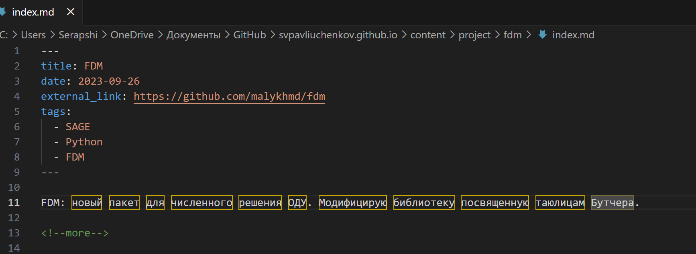
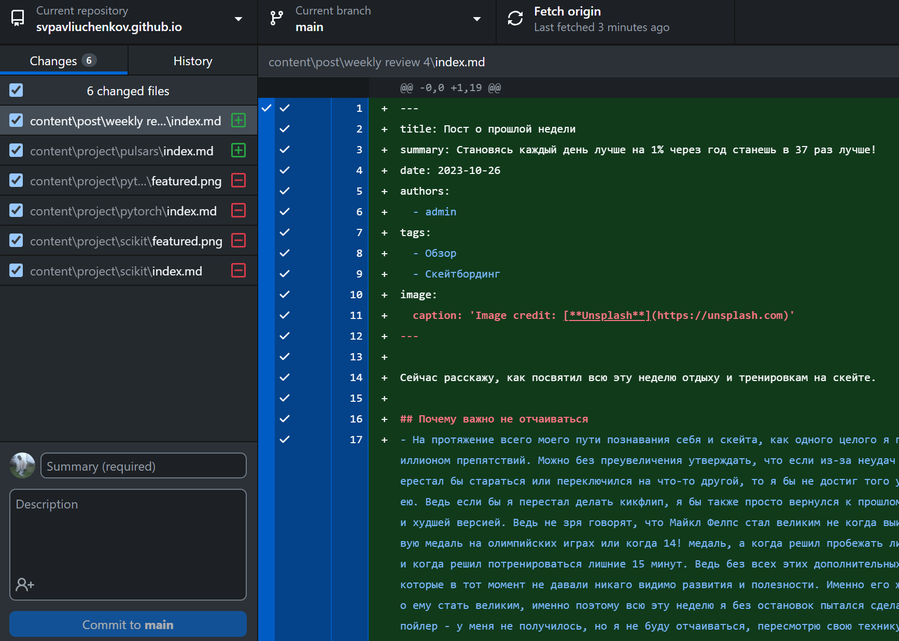
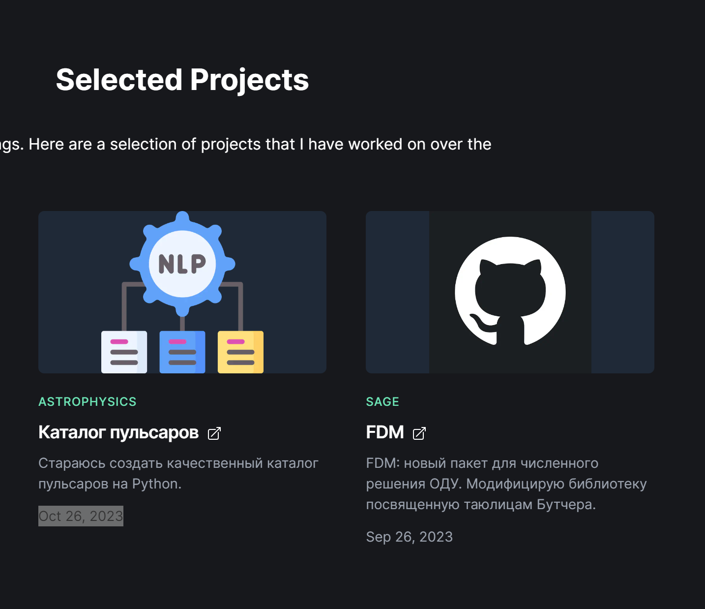
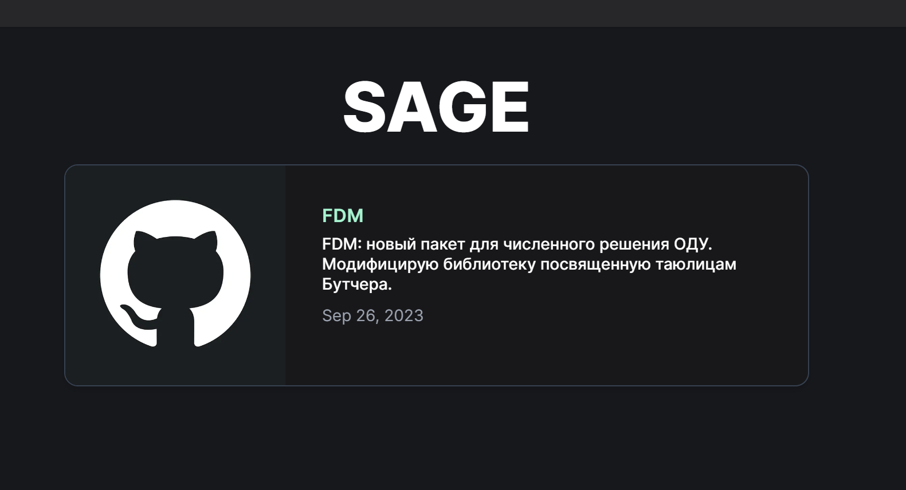
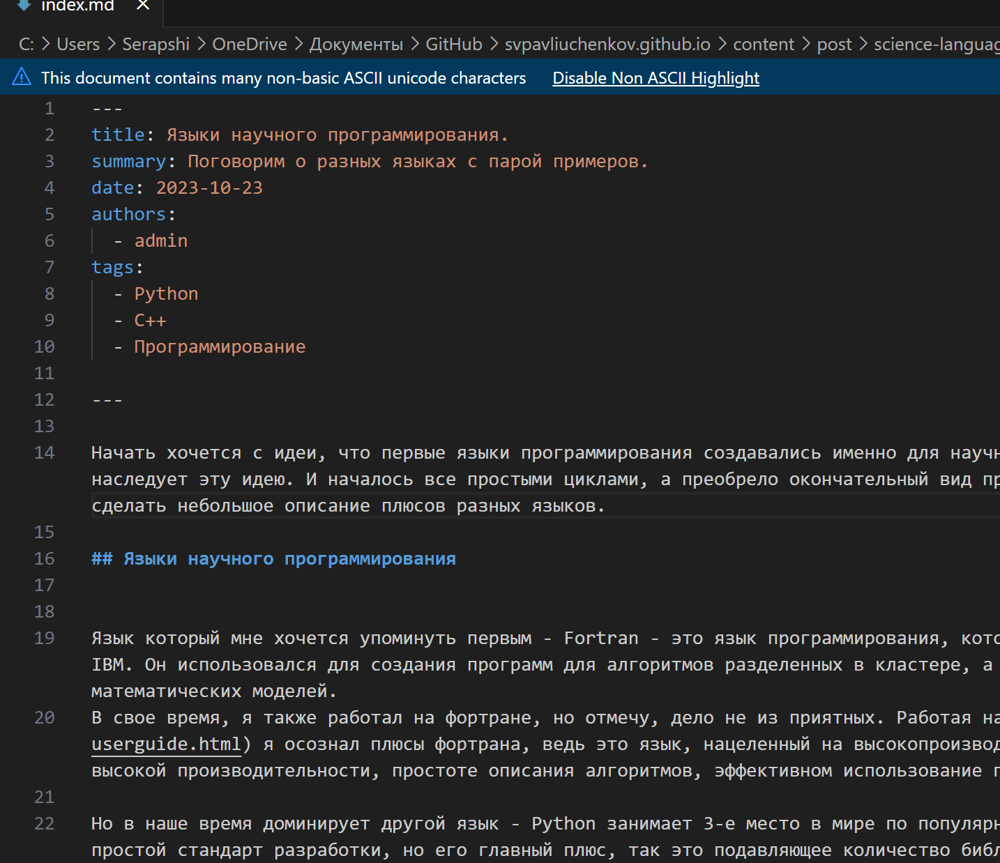
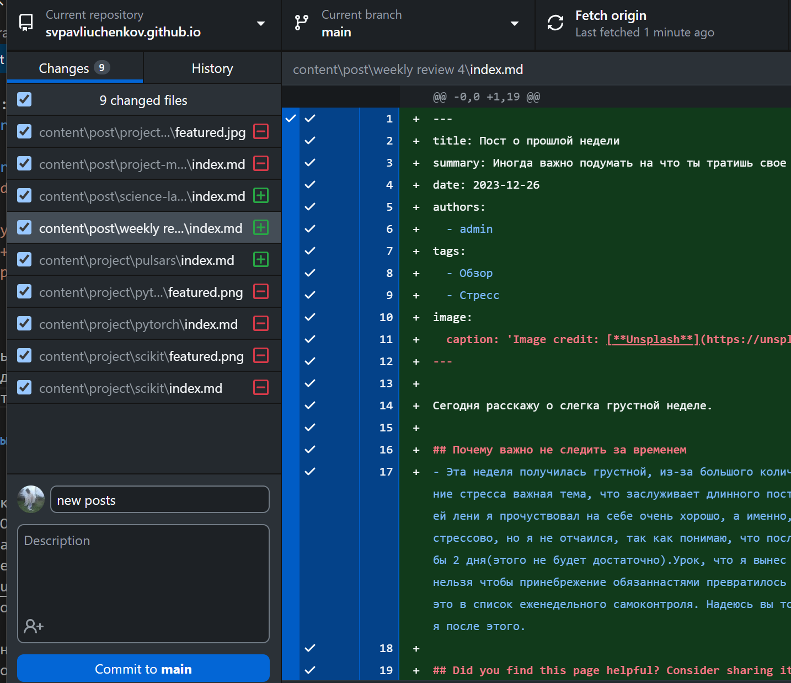
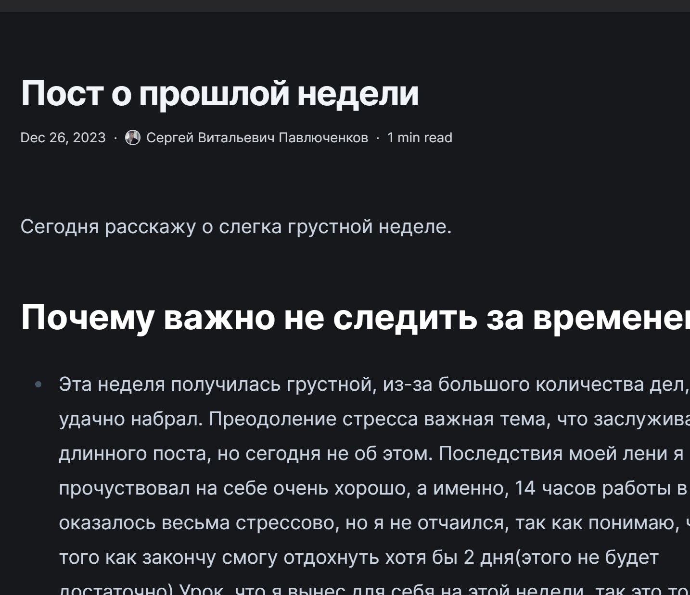

---
## Front matter
title: "Отчёт по 5 этапу индивидуального проекта"
subtitle: "Добавление персональных проектов"
author: "Сергей Витальевич Павлюченков"

## Generic otions
lang: ru-RU
toc-title: "Содержание"

## Bibliography
bibliography: bib/cite.bib
csl: pandoc/csl/gost-r-7-0-5-2008-numeric.csl

## Pdf output format
toc: true # Table of contents
toc-depth: 2
lof: true # List of figures
lot: true # List of tables
fontsize: 12pt
linestretch: 1.5
papersize: a4
documentclass: scrreprt
## I18n polyglossia
polyglossia-lang:
  name: russian
  options:
	- spelling=modern
	- babelshorthands=true
polyglossia-otherlangs:
  name: english
## I18n babel
babel-lang: russian
babel-otherlangs: english
## Fonts
mainfont: PT Serif
romanfont: PT Serif
sansfont: PT Sans
monofont: PT Mono
mainfontoptions: Ligatures=TeX
romanfontoptions: Ligatures=TeX
sansfontoptions: Ligatures=TeX,Scale=MatchLowercase
monofontoptions: Scale=MatchLowercase,Scale=0.9
## Biblatex
biblatex: true
biblio-style: "gost-numeric"
biblatexoptions:
  - parentracker=true
  - backend=biber
  - hyperref=auto
  - language=auto
  - autolang=other*
  - citestyle=gost-numeric
## Pandoc-crossref LaTeX customization
figureTitle: "Рис."
tableTitle: "Таблица"
listingTitle: "Листинг"
lofTitle: "Список иллюстраций"
lotTitle: "Список таблиц"
lolTitle: "Листинги"
## Misc options
indent: true
header-includes:
  - \usepackage{indentfirst}
  - \usepackage{float} # keep figures where there are in the text
  - \floatplacement{figure}{H} # keep figures where there are in the text
---

# Цель работы

Добавить на сайт информацию о проектах в которых, я до сих пор участвую или участвовал.

# Задание

Сделать записи для персональных проектов.
Сделать пост по прошедшей неделе.
Добавить пост на тему по выбору.
Языки научного программирования.

# Выполнение лабораторной работы

Обновляю информацию в директории content/project, а именно, переименновываю директорию шаблонного проекта в FDM, после чего меня информацию в файле index.md на информацию о своей работе.

{#fig:001 width=70%}

Удаляю часть ненужных файлов и загружаю файлы с проектами на сервер.

{#fig:002 width=70%}

Открываю страницу с личными проектами. 

{#fig:003 width=70%}

Проверяю являются ли проекты кликабельными

{#fig:007 width=70%}

Создаю пост о научных языках программирования. 

{#fig:004 width=70%}

Аналогично, создаю пост о прошедшей недели и загружаю все на гитхаб.

{#fig:005 width=70%}

После успешной сборки сайта проверяю, корректно ли собран новый материал в блоге

{#fig:006 width=70%}

# Выводы

Я научился добавлять информацию о персональных проектах на свой сайт и загрузил новый материал в его блог.
