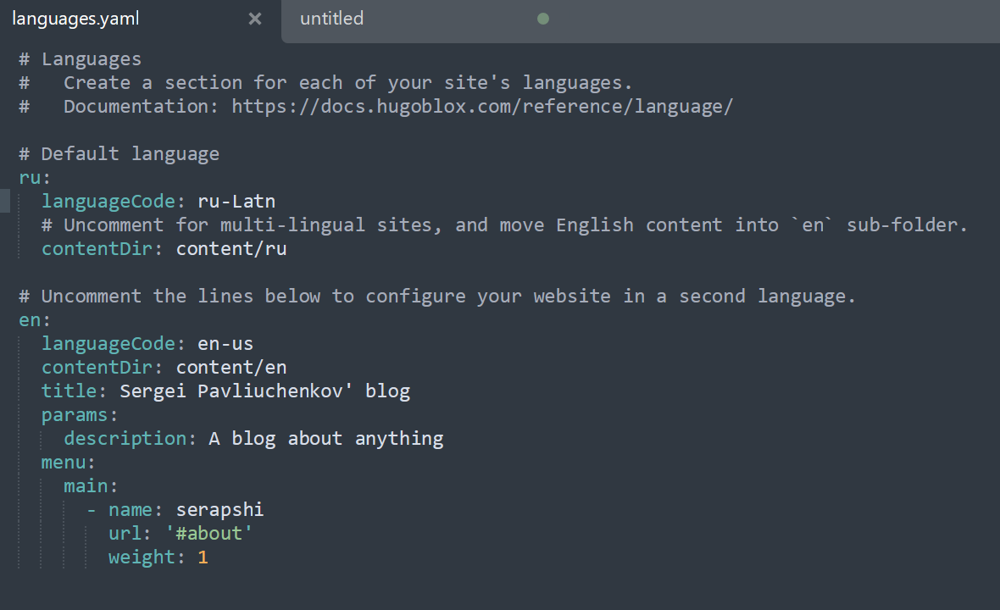
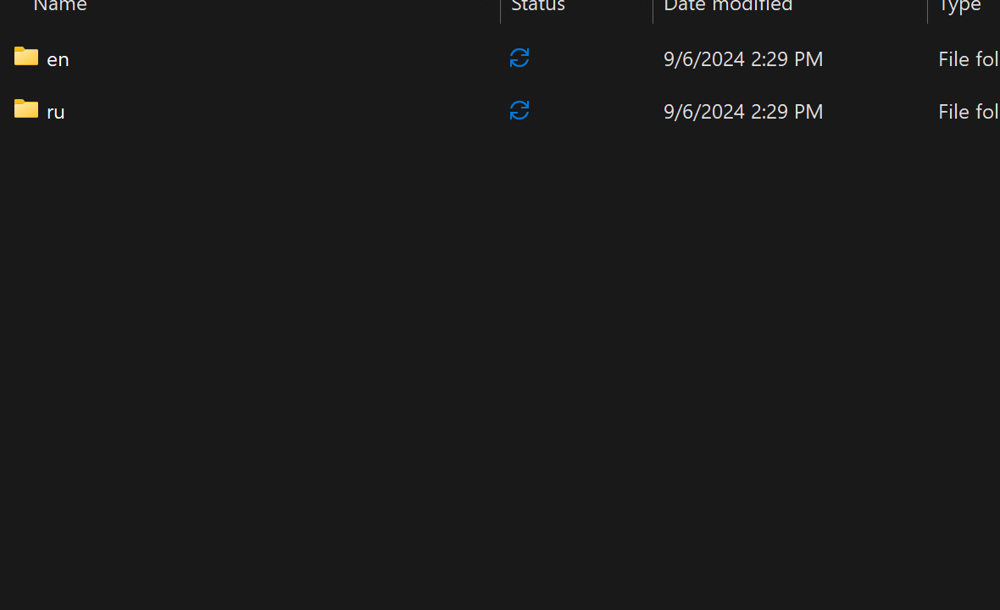
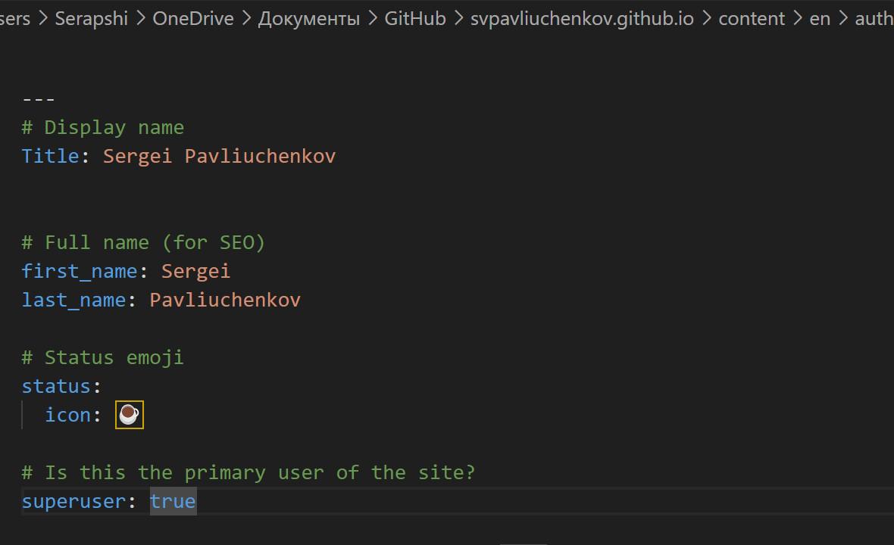
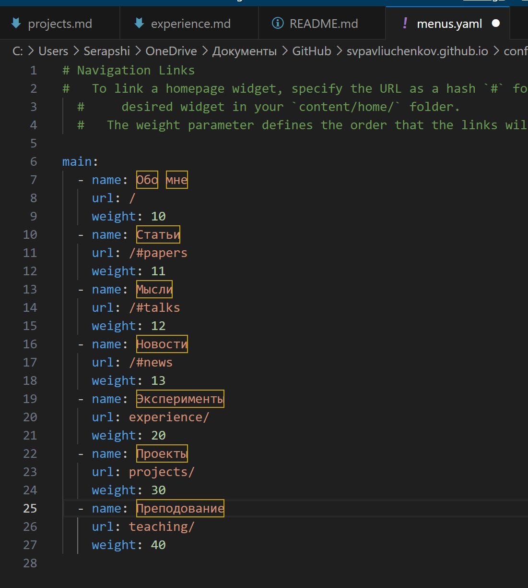
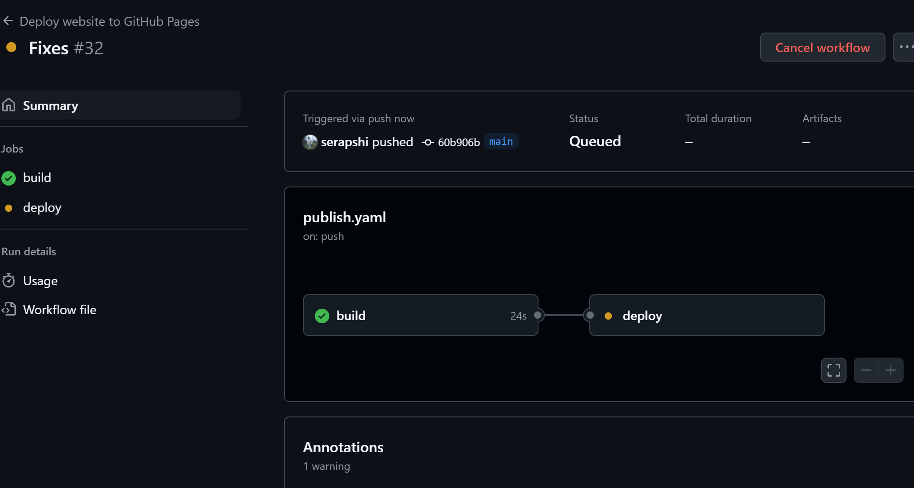
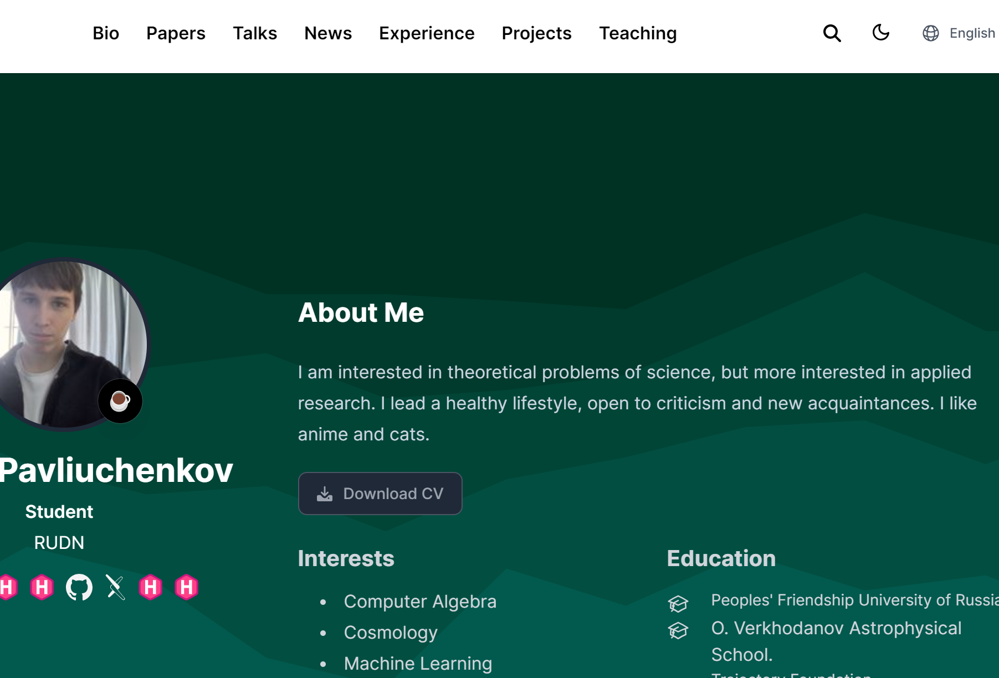
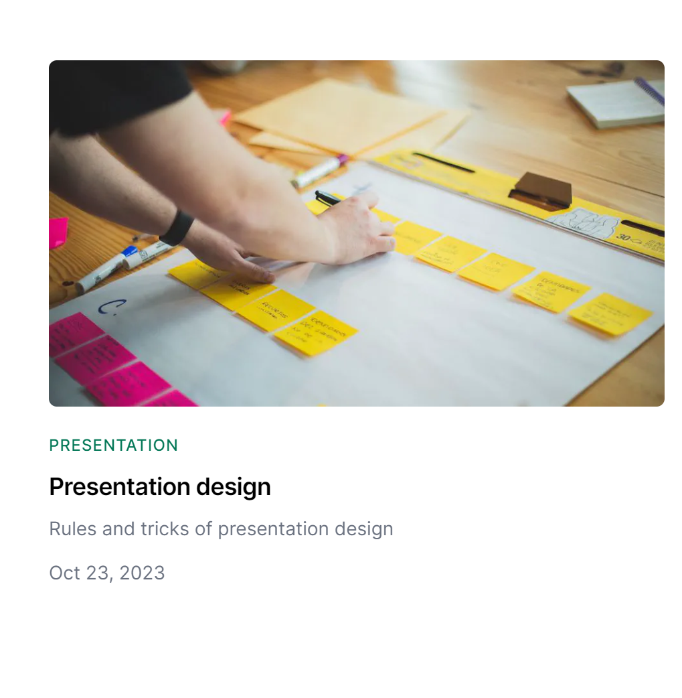
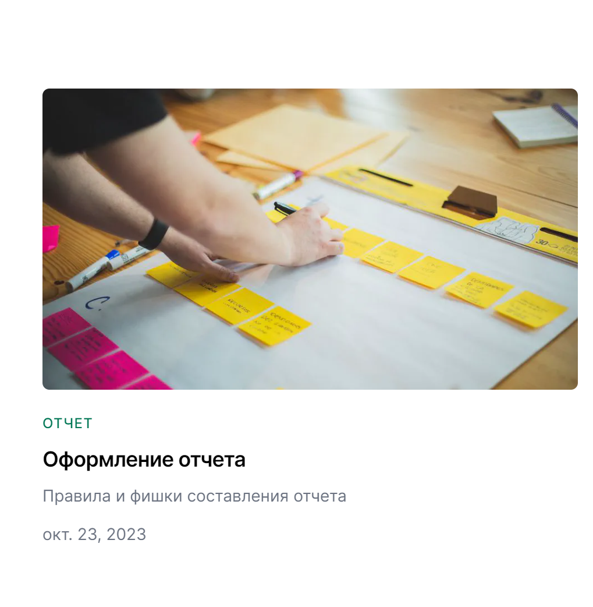

---
## Front matter
lang: ru-RU
title: Выполнение 6 этапа индивидуального проекта
subtitle: Размещение двуязычного сайта на Github.
author:
  - Павлюченков С.В.
institute:
  - Российский университет дружбы народов, Москва, Россия
date: 07 сентября 2024

## i18n babel
babel-lang: russian
babel-otherlangs: english

## Formatting pdf
toc: false
toc-title: Содержание
slide_level: 2
aspectratio: 169
section-titles: true
theme: metropolis
header-includes:
 - \metroset{progressbar=frametitle,sectionpage=progressbar,numbering=fraction}
---

## Докладчик

:::::::::::::: {.columns align=center}
::: {.column width="70%"}

  * Павлюченков Сергей Витальевич
  * Студент ФФМиЕН
  * Российский университет дружбы народов
  * [1132237372@pfur.ru](mailto:1132237372@pfur.ru)
  * <https://serapshi.github.io/svpavliuchenkov.github.io/>

:::
::: {.column width="30%"}

:::
::::::::::::::

## Цель работы

Разместить информацию о себе на сайте на двух языках.

## Задание

Сделать поддержку английского и русского языков.
Разместить элементы сайта на обоих языках.
Разместить контент на обоих языках.
Сделать пост по прошедшей неделе.
Добавить пост на тему по выбору (на двух языках).

# Выполнение лабораторной работы

## Добавление поддержки второго языка 

Открываю файл language.yaml, после чего изменяю 1 язык с английского на русский, и добавляю поддержку 2-го язык (английского). Также добавляю ссылки на для удобно перемещеия по сайту в англоязычной версии. 

{#fig:001 width=70%}

## Создание раздельных директорий для разных языков

{#fig:002 width=70%}

## Перевод сайта на второй язык - английский

{#fig:003 width=70%}

## Редактирование русской версии сайта

{#fig:004 width=70%}

## Сборка обновленной версии сайта

{#fig:005 width=70%}

## Проверка главной страницы сайта на английском

{#fig:006 width=70%}

## Проверка блога на английском

{#fig:007 width=70%}

## Проверка блога на русском

{#fig:008 width=70%}

## Выводы

Выполнив данный этап индивидуального проекта, у меня получилось успешно перевести свой сайт на второй язык - английский. Удалось создать кнопку для смены языка интерфейса сайта. Также теперь у меня появился свой рабочий сайт-резюме. 
