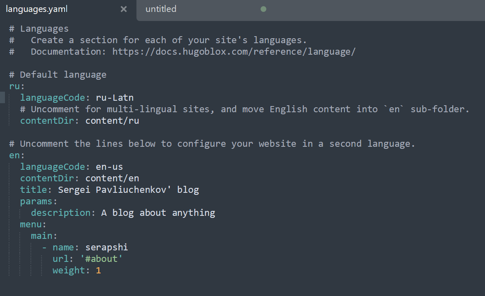
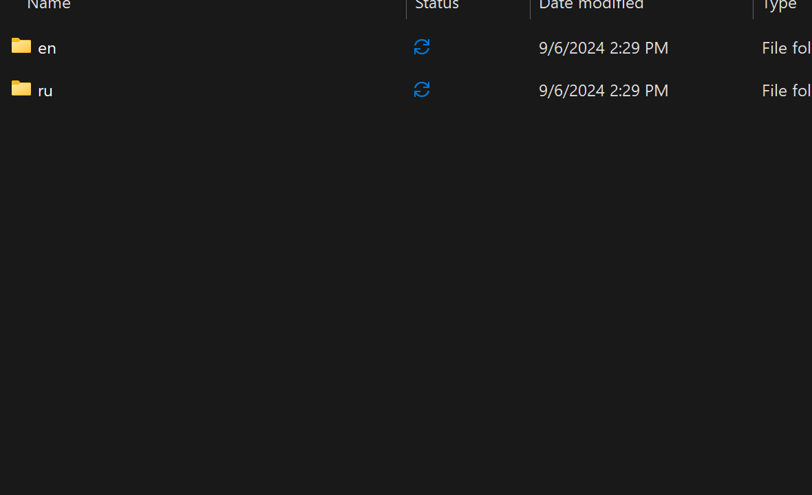
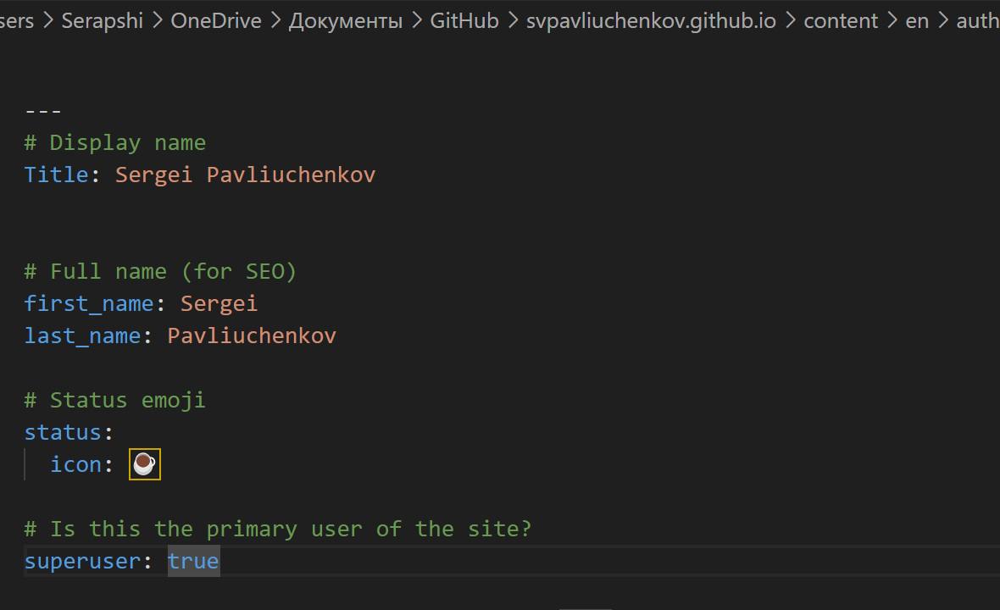
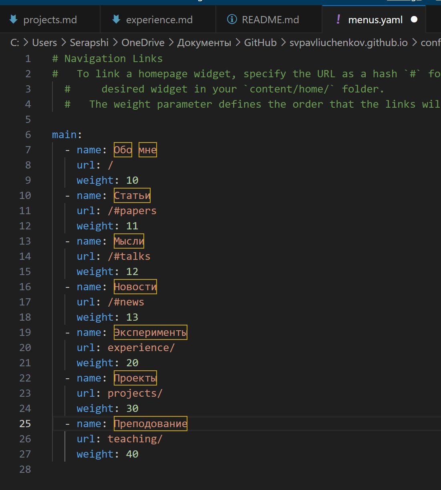
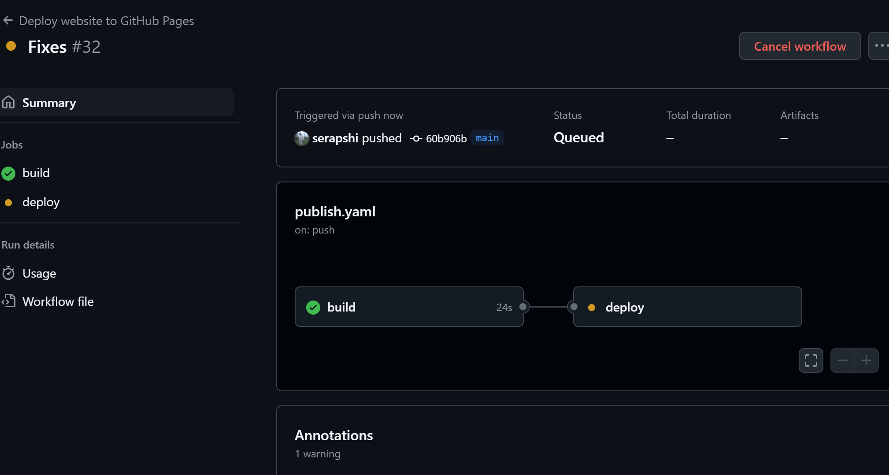
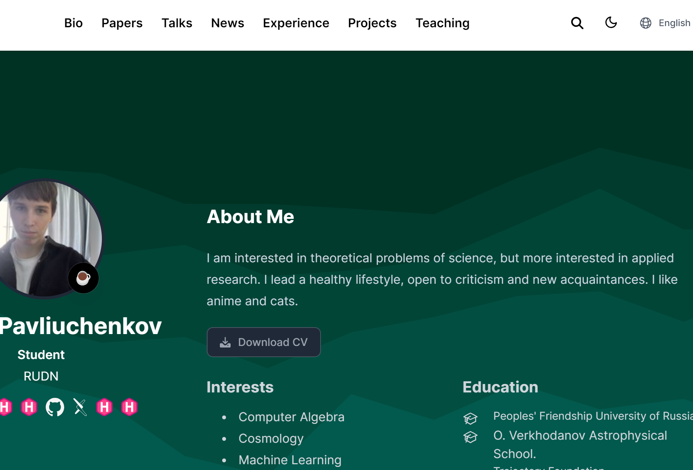
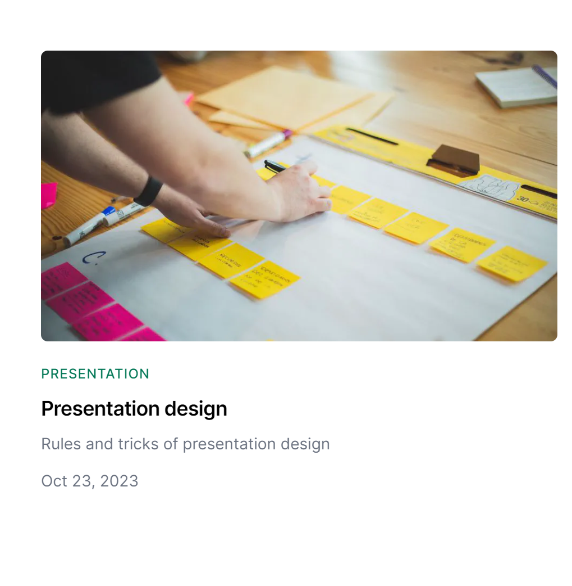
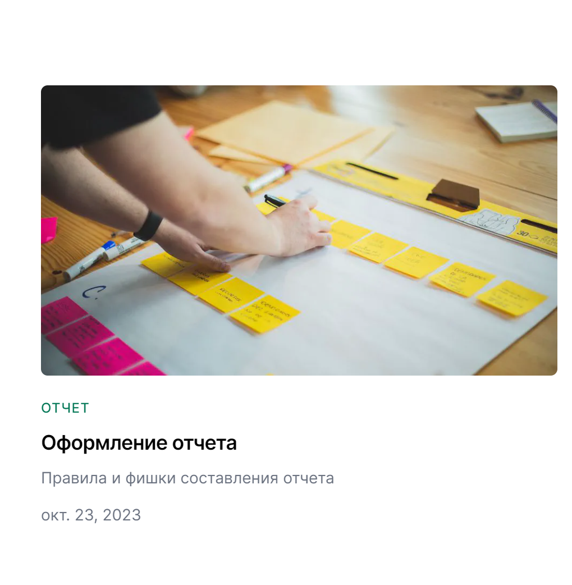

---
## Front matter
title: "Отчёт по 6 этапу индивидуального проекта"
subtitle: "Размещение двуязычного сайта на Github."
author: "Сергей Витальевич Павлюченков"

## Generic otions
lang: ru-RU
toc-title: "Содержание"

## Bibliography
bibliography: bib/cite.bib
csl: pandoc/csl/gost-r-7-0-5-2008-numeric.csl

## Pdf output format
toc: true # Table of contents
toc-depth: 2
lof: true # List of figures
lot: true # List of tables
fontsize: 12pt
linestretch: 1.5
papersize: a4
documentclass: scrreprt
## I18n polyglossia
polyglossia-lang:
  name: russian
  options:
	- spelling=modern
	- babelshorthands=true
polyglossia-otherlangs:
  name: english
## I18n babel
babel-lang: russian
babel-otherlangs: english
## Fonts
mainfont: PT Serif
romanfont: PT Serif
sansfont: PT Sans
monofont: PT Mono
mainfontoptions: Ligatures=TeX
romanfontoptions: Ligatures=TeX
sansfontoptions: Ligatures=TeX,Scale=MatchLowercase
monofontoptions: Scale=MatchLowercase,Scale=0.9
## Biblatex
biblatex: true
biblio-style: "gost-numeric"
biblatexoptions:
  - parentracker=true
  - backend=biber
  - hyperref=auto
  - language=auto
  - autolang=other*
  - citestyle=gost-numeric
## Pandoc-crossref LaTeX customization
figureTitle: "Рис."
tableTitle: "Таблица"
listingTitle: "Листинг"
lofTitle: "Список иллюстраций"
lotTitle: "Список таблиц"
lolTitle: "Листинги"
## Misc options
indent: true
header-includes:
  - \usepackage{indentfirst}
  - \usepackage{float} # keep figures where there are in the text
  - \floatplacement{figure}{H} # keep figures where there are in the text
---

# Цель работы

Разместить информацию о себе на сайте на двух языках.

# Задание

Сделать поддержку английского и русского языков.
Разместить элементы сайта на обоих языках.
Разместить контент на обоих языках.
Сделать пост по прошедшей неделе.
Добавить пост на тему по выбору (на двух языках).

# Выполнение лабораторной работы

Открываю файл language.yaml, после чего изменяю 1 язык с английского на русский, и добавляю поддержку 2-го язык (английского). Также добавляю ссылки на для удобно перемещеия по сайту в англоязычной версии. 

{#fig:001 width=70%}

Собираю все содержимое папки content в папку ru, после чего копирую ее и перреименновываю в en

{#fig:002 width=70%}

Начинаю работать с файлом en/admin/index.md. Перевожу все главную информацию о себе с русского на английский. 

{#fig:003 width=70%}

Переименновываю меню в русской версии сайта, попутно удаляя ненужные.

{#fig:004 width=70%}

Передаю все обновления на гитхаб и успешно собираю сайт. 

{#fig:005 width=70%}

Открываю новую версию сайта, теперь в правом верхнем углу доступна смена языка.

{#fig:006 width=70%}

В английской версии проверяю новый пост о презентациях, также перехожу в русскую версию сайта и проверяю, что все посты стабильно работают. 

{#fig:007 width=70%}

{#fig:008 width=70%}

# Выводы

У меня получилось успешно перевести свой сайт на английский и создать кнопку для смены языка интерфейса сайта.
